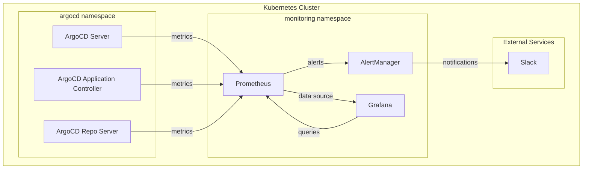

# ArgoCD Observability Platform

A comprehensive monitoring and alerting solution for ArgoCD deployments using Prometheus, Grafana, and AlertManager.

## 📋 Table of Contents

- [Overview](#overview)
- [Architecture](#architecture)
- [Components](#components)
- [Prerequisites](#prerequisites)
- [Installation](#installation)
- [Configuration](#configuration)
- [Usage](#usage)
- [Monitoring & Alerts](#monitoring--alerts)
- [Troubleshooting](#troubleshooting)
- [Contributing](#contributing)

## 🎯 Overview

This project provides a complete observability stack for monitoring ArgoCD deployments in Kubernetes. It includes:

- **Prometheus**: Metrics collection and storage
- **Grafana**: Visualization and dashboards
- **AlertManager**: Alert routing and notification management
- **Custom Alerts**: Pre-configured alerts for ArgoCD components

## 🏗️ Architecture



## 🔧 Components

### 1. Prometheus
- **Version**: v2.45.0
- **Port**: 9090 (NodePort: 30000)
- **Storage**: 200h retention
- **Scraping**: 5s intervals
- **Features**:
  - Kubernetes service discovery
  - ArgoCD metrics collection
  - Custom alerting rules

### 2. Grafana
- **Version**: 10.0.0
- **Port**: 3000 (NodePort: 32000)
- **Default Credentials**: admin/admin123
- **Features**:
  - Pre-configured dashboards
  - Prometheus data source
  - ArgoCD-specific visualizations

### 3. AlertManager
- **Version**: v0.26.0
- **Port**: 9093
- **Features**:
  - Slack integration
  - Alert grouping and routing
  - Resolve notifications

## 📋 Prerequisites

- Kubernetes cluster (v1.19+)
- kubectl configured
- ArgoCD installed in the `argocd` namespace
- Slack webhook URL (for notifications)

## 🚀 Installation

### 1. Create Monitoring Namespace

```bash
kubectl create namespace monitoring
```

### 2. Apply RBAC Configuration

```bash
kubectl apply -f prometheus-rbac.yaml
```

### 3. Deploy Prometheus

```bash
kubectl apply -f prometheus-config.yaml
kubectl apply -f prometheus-deployment.yaml
```

### 4. Deploy AlertManager

```bash
kubectl apply -f alertmanager-config.yaml
kubectl apply -f alertmanager-deployment.yaml
```

### 5. Deploy Grafana

```bash
kubectl apply -f grafana-deployment.yaml
```

### 6. Verify Installation

```bash
kubectl get pods -n monitoring
kubectl get services -n monitoring
```

## ⚙️ Configuration

### Prometheus Configuration

The Prometheus configuration includes:

- **Global Settings**:
  - Scrape interval: 5s
  - Evaluation interval: 5s
  - Storage retention: 200h

- **Scrape Targets**:
  - ArgoCD Server metrics
  - ArgoCD Application Controller metrics
  - Kubernetes pods with metrics annotations

### AlertManager Configuration

```yaml
global:
  slack_api_url: 'YOUR_SLACK_WEBHOOK_URL'

route:
  group_by: ['alertname']
  group_wait: 10s
  group_interval: 10s
  repeat_interval: 1h
  receiver: 'slack-notifications'
```

### Alert Rules

Pre-configured alerts include:

- **ArgoCDServerDown**: Detects when ArgoCD server is unavailable
- **ArgoCDApplicationControllerDown**: Detects when application controller is down
- **ArgoCDSyncFailed**: Monitors sync failures
- **ArgoCDHealthCheckFailed**: Monitors health check failures

## 📊 Usage

### Accessing the Services

1. **Prometheus UI**:
   ```bash
   kubectl port-forward -n monitoring svc/prometheus-service 9090:9090
   ```
   Then visit: http://localhost:9090

2. **Grafana Dashboard**:
   ```bash
   kubectl port-forward -n monitoring svc/grafana 3000:3000
   ```
   Then visit: http://localhost:3000
   - Username: `admin`
   - Password: `admin123`

3. **AlertManager UI**:
   ```bash
   kubectl port-forward -n monitoring svc/alertmanager-service 9093:9093
   ```
   Then visit: http://localhost:9093

### Key Metrics to Monitor

```promql
# ArgoCD Server Health
up{job="argocd-server"}

# ArgoCD Application Controller Health
up{job="argocd-application-controller"}

# Sync Status
argocd_app_sync_total

# Application Health
argocd_app_health_status
```

## 🚨 Monitoring & Alerts

### Alert Severity Levels

- **Critical**: Immediate attention required
- **Warning**: Monitor closely
- **Info**: Informational alerts

### Slack Notifications

Alerts are sent to Slack with:
- Emoji indicators
- Detailed descriptions
- Severity levels
- Resolve notifications

### Customizing Alerts

Edit `prometheus-config.yaml` to modify alert rules:

```yaml
- alert: CustomAlert
  expr: your_promql_expression
  for: 5s
  labels:
    severity: warning
  annotations:
    summary: "Alert Summary"
    description: "Detailed description"
```

## 🔍 Troubleshooting

### Common Issues

1. **Prometheus can't scrape ArgoCD metrics**:
   ```bash
   kubectl logs -n monitoring deployment/prometheus
   kubectl get endpoints -n argocd
   ```

2. **Alerts not firing**:
   ```bash
   kubectl logs -n monitoring deployment/alertmanager
   kubectl get configmap -n monitoring alertmanager-config -o yaml
   ```

3. **Grafana can't connect to Prometheus**:
   - Verify Prometheus service is running
   - Check data source configuration in Grafana

### Useful Commands

```bash
# Check pod status
kubectl get pods -n monitoring

# View logs
kubectl logs -n monitoring deployment/prometheus
kubectl logs -n monitoring deployment/grafana
kubectl logs -n monitoring deployment/alertmanager

# Check services
kubectl get svc -n monitoring

# Verify RBAC
kubectl get clusterrole prometheus
kubectl get clusterrolebinding prometheus
```

## 📈 Performance Considerations

### Resource Requirements

- **Prometheus**: 200m CPU, 1000Mi memory (requests)
- **Grafana**: 250m CPU, 750Mi memory (requests)
- **AlertManager**: Default resource allocation

### Scaling Recommendations

- Monitor Prometheus memory usage
- Consider persistent storage for production
- Implement service mesh for secure communication
- Use ingress controllers for external access

## 🤝 Contributing

1. Fork the repository
2. Create a feature branch
3. Make your changes
4. Test thoroughly
5. Submit a pull request

## 📄 License

This project is licensed under the MIT License - see the LICENSE file for details.

## 🔗 Related Links

- [ArgoCD Documentation](https://argo-cd.readthedocs.io/)
- [Prometheus Documentation](https://prometheus.io/docs/)
- [Grafana Documentation](https://grafana.com/docs/)
- [AlertManager Documentation](https://prometheus.io/docs/alerting/latest/alertmanager/)

---

**Note**: Remember to update the Slack webhook URL in `alertmanager-config.yaml` before deploying to production. 